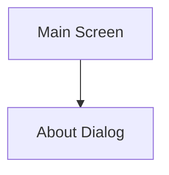
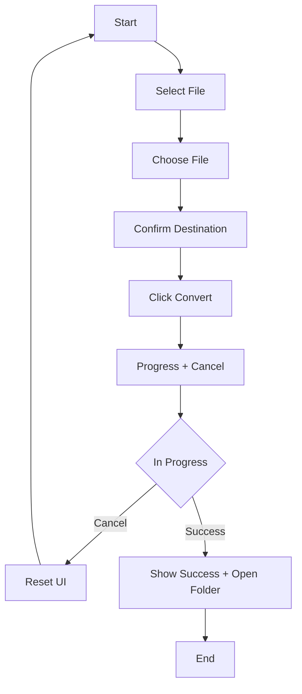

# Desktop Video Converter UI/UX Specification

| Date         | Version | Description              | Author         |
|--------------|---------|--------------------------|----------------|
| Aug 29, 2025 | 1.0     | Initial UI/UX Spec Draft | Sally, UX Expert |

## Introduction
Defines UX goals, information architecture, user flows, and visual design specifications for the Desktop Video Converter.

### UX Goals & Principles

**Target User Personas**
- Home User: Non-technical, prioritizes simplicity and speed.

**Usability Goals**
- Ease of Learning: Convert video in < 1 min without instructions.
- Efficiency: Minimal clicks from file selection to saving.
- Error Prevention: Disable irrelevant buttons.

**Design Principles**
1. Clarity Above All.
2. Progressive Disclosure.
3. Provide Feedback.

## Information Architecture

**Screens**
- Main Screen
- About Dialog

**Navigation**
- Primary: None (single-function app).
- Secondary: "About" button.

### User Flows
Goal: Convert a video to web-optimized MP4.

**Edge Cases**
- Invalid/corrupt file.
- Conversion failure.
- Insufficient permissions.

## Wireframes & Mockups
Main Screen Elements:
- Select Video File
- Source File Display
- Save Destination Display
- Change, Convert, Cancel, Open Folder buttons
- Progress Bar
- Success Message
- About button

UI States: Initial, File Selected, Converting, Success.

## Component Library
**Core Components**
- Primary Button: Select/Convert.
- Secondary Button: Change/Cancel/Open Folder.
- Path Display: Empty/Populated.
- Progress Bar: In-progress.
- Text Link: About.

## Branding & Style Guide

**Colors**
- Primary: #0078D4
- Secondary: #6C757D
- Success: #28A745
- Error: #DC3545
- Neutral: #F8F9FA, #212529, #ADB5BD

**Typography**
- Font: Segoe UI
- Headings: 18px
- Body: 14px
- Buttons: 14px
- Small Text: 12px

**Icons**
- Lucide Icons

**Layout**
- 8px grid

**Accessibility**
- WCAG 2.1 AA
- Keyboard navigation, screen reader support, color contrast

**Responsiveness**
- Fixed-size Windows desktop app

**Animations**
- Minimal: hover, progress bar

**Performance**
- Fast startup, low memory usage, responsive UI
